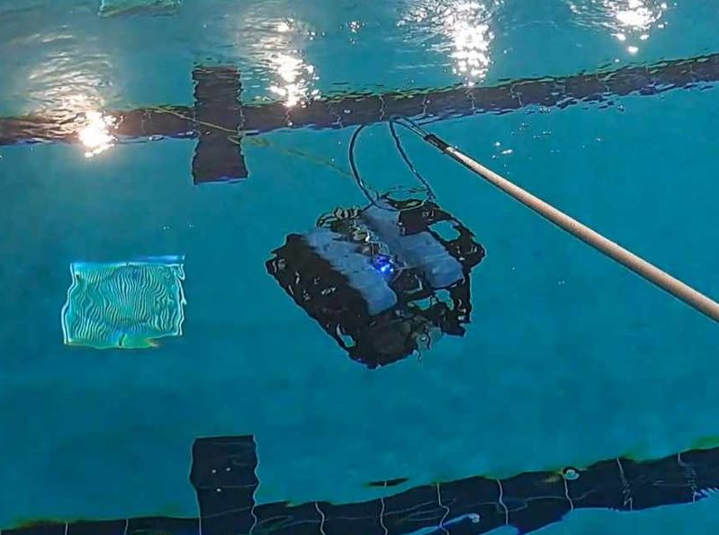
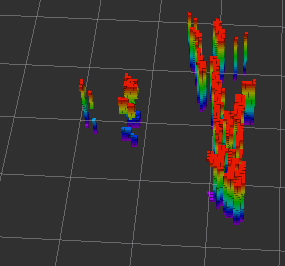

# Path Planning Map Generation

Clone this path planning branch of the repository and build docker
```
git clone -b path_planning https://github.com/CapstoneROV/NYUAD-ROV-Capstone-Repo.git

cd NYUAD-ROV-Capstone-Repo

make run
```
Details on running the docker found at end

This docker environment consist of the packages to generate an OctoMap both in simulation and real life by using the Ping360 Sonar mounted on BlueROV2. 

### Simulation of OctoMap Generation
Start the sonar simulation from [sonar_testing package](https://github.com/CapstoneROV/sonar_testing). A point cloud is published on /dummy/ping360_sim_depth/depth/points from ping360_depth_link 

```
roslaunch sonar_testing dummy.launch
```

Transform the point cloud from ping360_depth_link to map

```
rosrun sonar_testing pcltransformer
```

Subscribe to the transformed point cloud and generate the octomap

```
roslaunch octomap_server octomap_mapping.launch
```


Add some obstacles in gazebo and run the box to observe the octomap when moving 
```
rostopic pub /dummy/goal geometry_msgs/PoseStamped '{header: {stamp: now, frame_id: "map"}, pose: {position: {x: 1.0, y: 0.0, z: 2.0}, orientation: {w: 1.0, x: 0.0, y: 0.0, z: 0.0}}}'
```


### Octomap Generation in Ping360 BlueROV2

To get the sonar image and point cloud from the Ping360 Sonar of BlueRov2, [the bluerobotics_ping360](https://github.com/GSO-soslab/bluerobotics_ping360.git) ROS1 package is utilized. The parameters for the sonar such as scanning angle range and address can be adjusted in ping360.yaml config file and the approximate point cloud is published on /filtered_msis topic.


<center>Sonar image being generated real time on bottom left</center>
<br>
The nodes for getting the sonar image and processed point cloud can be run with

``` 
roslaunch ping360_sonar ping360_sonar.launch 
```

The bluerov2 link is acquired from the pose of the ROV in real time and the transformation from the ping360 link (of the /filtered_msis topic) to the map is done using [pose_to_tf](https://github.com/CapstoneROV/pose_to_tf.git) package

```
roslaunch pose_to_tf pose_to_tf.launch
```

To register the point cloud and build an octomap

```
roslaunch octomap_server octomap_mapping.launch
```

<div style="display: flex; justify-content: space-around;">
  
  
</div>
<br>
<center>Obstacle in front of the ROV at left and OctoMap of the obstacle and front wall on right </center>

<br>

For any queries on the map generation, reach out to Kirubel Solomon at kt2350@nyu.edu

# NYUAD ROV Capstone Repo


This is the docker environment, loaded out of the box with Ubuntu 18.04, ROS Melodic, Python, supporting both versions 2.7 and 3, to ensure compatibility with a wide range of existing tools and scripts, for the NYUAD Capstone Underwater RoV project.

This is intended for a straightforward and practical approach to setting up a development environment for our underwater robot. 

This container supports Python both versions 2.7 and 3, to ensure compatibility with a wide range of existing tools and scripts, with a variety of Python packages like numpy and scipy, essential for data analysis and algorithm development. Additionally, the setup facilitates GUI applications, crucial for visual tools like RViz, gazebo out of the box.

We ensure the ROS environment is always ready by sourcing it in the bashrc file, and we set our working directory to '/capstonerov' in mounted docker container to keep our project organized. 

## Running Docker Container with GUI support (Linux) - working
To run the docker container and automatically build it if necessary run this(If you make any edits to files **outside** src folders rerun this):
```
make run 
```

If you want to rerun the container(restart from existing image):
```
make rerun
```

To run simulation: (Run this in docker container)
```
make launch_sim
```
then run in a separate terminal:
```
docker exec -it capstonerov /bin/bash
make launch_sitl
```

If you notice your memory pile up run this: (TODO, automatically delete old images)
```
docker system prune -a
```
# Using GUI

To run GUI applications in docker container (e.g. gazebo, rviz), you need to configure the container to use the X server of your host machine.

```
xhost +local:docker
```

## Contributing
Contributions are welcome. Please adhere to this project's code of conduct.

## License
This project is licensed under the MIT License - see the LICENSE.md file for details.

## Contact
For any queries or suggestions, please reach out to Rami Richani at rir8190@nyu.edu or Pi Ko at pk2269@nyu.edu.
